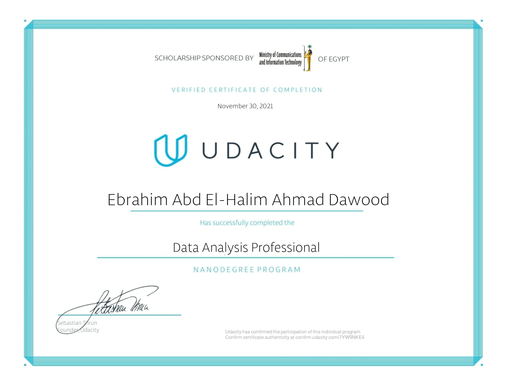
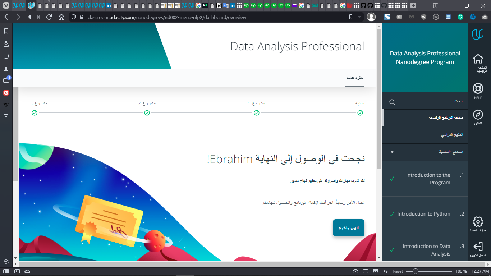

# Data Analysis and Visualization Professional Python Projects
 Projects of Data Analysis & Visualization Course (Professional Track) Held by Udacity
 Using Python Scripting & Jupiter Notebook.

## Project 1: Data Analysis of U.S. Bike Share Riders Dataset Using Python Scripting

for the Project Code main.Py [Click Here](./Data%20Analysis%20Project.1.%20U.S.%20Bike%20Share%20Riders%20Data%20Analysis%20Using%20Python%20Scripting/US%20Bike%20Share%20V.2_2nd%20Try/bikeshare%20version2.py)

## Project 2: Invistigate Patients No-Show Reasons Using Python Scripting & Jupiter Notebook

for the Project Code main.Py [Click Here](./Data%20Analysis%20Project.2.%20Invistigate%20Patients%20No-Show%20Reasons%20Using%20Python%20Scripting%20&%20Jupiter%20Notebook/V.2_2nd%20Attempt/investigate-a-dataset-template2.ipynb)

### The Certificate:

 

### The Moment of Acheiving the Goal (After 4 Months of the Course) :

### Confirm the Certificate authenticity :

open [this link](http://confirm.udacity.com/7YW9NKE6) to Confirm the Certificate authenticity at

http://confirm.udacity.com/7YW9NKE6

https://www.udacity.com/certificate/7YW9NKE6

Udacity has Confirmed the participation of this Program

