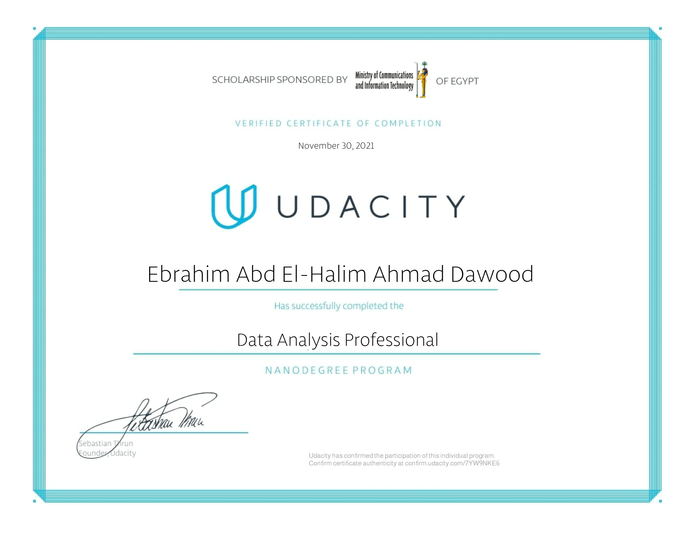
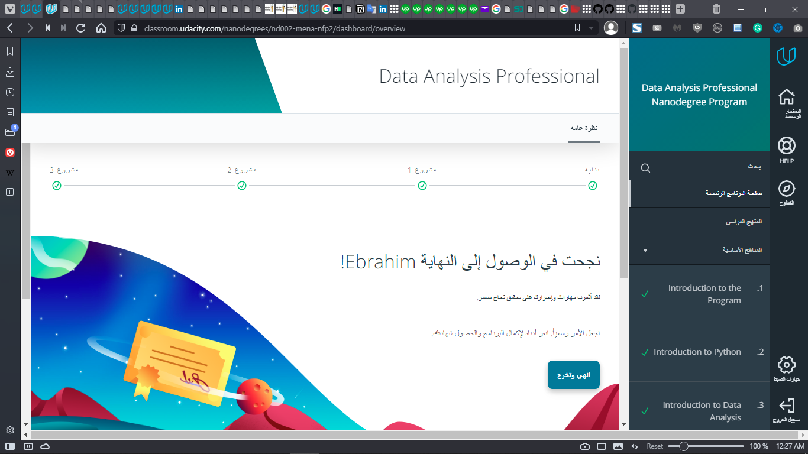

# Data Analysis and Visualization Professional Python Projects
 Projects of Data Analysis & Visualization Course (Professional Track) Held by Udacity
 Using Python Scripting & Jupiter Notebook.

## Project 1: Data Analysis of U.S. Bike Share Riders Dataset Using Python Scripting

for the Project Code main.Py [Click Here](./Data Analysis Project.1. U.S. Bike Share Riders Data Analysis Using Python Scripting/US Bike Share V.2 (2nd Try)/bikeshare_version2.py)

## Project 2: Invistigate Patients No-Show Reasons Using Python Scripting & Jupiter Notebook

for the Project Code main.Py [Click Here](./Data Analysis Project.2. Invistigate Patients No-Show Reasons Using Python Scripting & Jupiter Notebook/V.2 (2nd Attempt)/investigate-a-dataset-template2.ipynb)

### The Certificate:

 

### The Moment of Acheiving the Goal (After 4 Months of the Course) :

### Confirm the Certificate authenticity :

open [this link](http://confirm.udacity.com/7YW9NKE6) to Confirm the Certificate authenticity at

http://confirm.udacity.com/7YW9NKE6

https://www.udacity.com/certificate/7YW9NKE6

Udacity has Confirmed the participation of this Program

